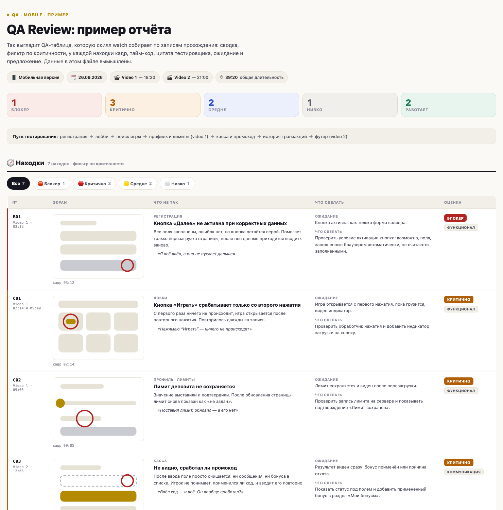

# watch: скилл для Claude Code, который смотрит видео целиком

Claude Code сам по себе не видит видео. Скилл `watch` даёт ему глаза и уши:

- **Слышит.** Берёт субтитры (yt-dlp) или расшифровывает голос локальной моделью распознавания речи (whisper).
- **Видит.** Достаёт кадры по смене сцен (ffmpeg), а не по таймеру, поэтому не пропускает интерфейс, слайды и демо.
- **Сопоставляет.** Связывает слова из транскрипта с картинкой на экране по тайм-кодам.
- **Отдаёт результат в нужной форме.** Обычный разбор, QA-таблица, сравнение конкурентов, UX-аудит, протокол созвона, конспект лекции.

Работает со ссылками на видео (видеохостинги, записи экрана и встреч, прямой mp4) и с локальными файлами, например с записью экрана.

## Пример: QA-таблица по записи прохождения



Живой пример с фильтром по критичности: [examples/qa-review.html](examples/qa-review.html) (скачайте репозиторий и откройте файл в браузере). Шрифты подгружаются из сети, без интернета подставятся системные. Данные в нём вымышлены.

У каждой находки есть экран, тайм-код, кадр, цитата тестировщика, ожидание, предложение и критичность. Структура и правила описаны в [templates/qa-table.md](templates/qa-table.md). Другие форматы таблиц (сравнение, UX-аудит, протокол созвона, конспект) лежат в [templates/other-tables.md](templates/other-tables.md). Формат выбирает пользователь: скилл спросит, если вы его не назвали.

## Установка

Нужен Claude Code (в терминале, в десктопном приложении или в расширении для редактора) на macOS или Linux. Скилл запускает команды на вашей машине, поэтому нужны `yt-dlp`, `ffmpeg` и `whisper`.

### Способ 1. Одна команда

```bash
git clone https://github.com/igamingsychov/watch-igaming.git ~/.claude/skills/watch
bash ~/.claude/skills/watch/install.sh --deps
```

Первая команда кладёт скилл туда, где Claude Code его ищет. Вторая проверяет `yt-dlp`, `ffmpeg`, `whisper` и доустанавливает недостающее (macOS: через brew, Linux: через apt и pipx). Без `--deps` скрипт только покажет, чего не хватает, и команды для установки.

### Способ 2. Скрипт из скачанного репозитория

```bash
git clone https://github.com/igamingsychov/watch-igaming.git
cd watch-igaming
./install.sh --deps
```

Скрипт копирует скилл в `~/.claude/skills/watch` (если папка уже есть, спросит разрешение) и проверяет зависимости. Параметры: `--check` (только проверка), `--force` (без вопроса о перезаписи), `CLAUDE_SKILLS_DIR=/путь` (другая папка скиллов).

### Способ 3. Пусть Claude установит сам

Откройте Claude Code и вставьте:

```text
Установи скилл watch из https://github.com/igamingsychov/watch-igaming :
1. Склонируй репозиторий в ~/.claude/skills/watch. Если такая папка уже есть, спроси меня, что делать.
2. Проверь, что стоят yt-dlp, ffmpeg и whisper. Чего не хватает, покажи команды установки и спроси разрешение.
3. Скажи, когда закончишь, и что мне написать для проверки.
```

### Проверка

Перезапустите Claude Code (или откройте новую сессию) и спросите: `Какие у тебя есть скиллы?` В списке будет `watch`. Затем:

```text
посмотри видео <ссылка>
```

или `/watch <ссылка>`.

### Только для одного проекта

Положите папку в `<проект>/.claude/skills/watch`: тогда скилл будет доступен только в этом проекте.

### Обновление и удаление

```bash
git -C ~/.claude/skills/watch pull     # обновить
rm -rf ~/.claude/skills/watch          # удалить
```

## Как пользоваться

Примеры запросов:

- `посмотри это видео и сделай разбор: <ссылка>`
- `/watch <ссылка>`
- `посмотри запись /Users/me/Movies/прохождение.mov и собери QA-таблицу`
- `вот три записи прохождения конкурентов, сравни их: раздел, у нас, конкурент A, конкурент B, вывод, тайм-код`
- `разбери запись созвона, нужен протокол: тема, решение, ответственный, срок`

Рабочие файлы (транскрипт, кадры, лог) лежат в `/tmp/watch/<slug>`, проект скилл не засоряет.

## Как это устроено

1. **Транскрипт.** Сначала субтитры через yt-dlp (только для ссылок), если их нет или файл локальный, аудио уходит в Whisper.
2. **Кадры.** ffmpeg берёт кадры там, где сменилась сцена, и записывает тайм-коды. Нужный кадр по тайм-коду и плотную выборку для быстрых элементов (ленты, таймеры) скилл снимает отдельной командой.
3. **Анализ.** Claude читает транскрипт, смотрит кадры и сверяет слова с экраном по тайм-кодам.
4. **Отчёт.** Разбор или таблица по шаблону. Правило: у каждого пункта тайм-код, у находки кадр и цитата только из записи.

## Если что-то не работает

| Симптом | Что делать |
|---|---|
| `Unrecognized option 'vsync'` | Свежий ffmpeg убрал этот ключ. В этой версии скилла уже стоит `-fps_mode vfr` |
| Кадров по смене сцен 0 | Запись с плавными переходами. Снизьте порог `scene` с 0.3 до 0.05-0.1 |
| `showinfo`-лог пустой | Уберите `-loglevel error` из команды ffmpeg |
| `whisper: command not found` | macOS: `brew install openai-whisper`. Linux: `pipx install openai-whisper` |
| `externally-managed-environment` | Не ставьте через голый `pip`, используйте brew или pipx |
| yt-dlp не скачивает | Обновите: `brew upgrade yt-dlp` или `pipx upgrade yt-dlp` |
| Расшифровка речи идёт долго | Это нормально для длинных записей. Модель `small` быстрее, `medium` точнее |
| Видео за логином | Скилл его не обходит |

## Отличия от исходной версии watch

- ffmpeg: `-fps_mode vfr` вместо удалённого `-vsync vfr`.
- Локальные файлы (запись экрана) и несколько записей с тайм-кодами вида `Video N · mm:ss`.
- Кадр ровно по тайм-коду и плотная выборка для быстрых элементов.
- Форматы отчёта, шаблоны таблиц и пример QA-таблицы.
- Правила достоверности: тайм-код и кадр у каждой находки, цитаты только из записи.
- Установка через brew и pipx вместо `pip`, который новые системы блокируют.

## Автор и лицензия

Автор: Yevhen Sychov. Лицензия MIT, см. [LICENSE](LICENSE).
